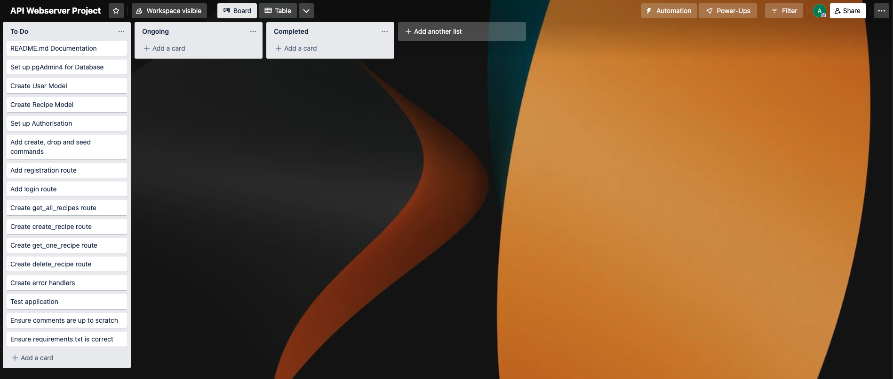

# Adam Dobson – T2A2 – Food Recipe API Webserver Project

## [GitHub Repository](https://github.com/dobbbo/FlaskAPI)

## 1. Identification of the problem you are trying to solve by building this particular app.
This app will function as a food recipe sharing service where users can share their favourite food recipes with each other. The client (end user) will have the ability to create, read, update or delete posts related to their recipes. Additionally, users can register and login to their own user profile using their email address and a password, allowing for a more personalised and secure user experience.
The problem that this application looks to solve is to make food recipes easier to find and share. Food preparation is often something that people struggle with, whether it’s due to a lack of time, knowledge or willingness – often leading to ordering unhealthy or expensive food from restaurants. This app will concisely provide the end user with all the ingredients, apparatus and preparation techniques that they will need to prepare their own food at home, leading to less food expenses, a healthier diet and improved cooking skills.

## 2. Why is it a problem that needs solving?
This app is intended to be used like a forum, where users are able to include a relatively open-ended description under their recipe title – as such, users are able to add as much or as little detail about their recipes as they please. This ability to share recipes can immensely fast-track the end-users learning curve when it comes to cooking/preparing their own food at home – helping to make food preparation an easier, more fun and social experience.
The aim of this app is to encourage and enable the preparation of home-cooked/home-prepared meals. There are many reasons why this is a problem that needs solving, namely:
-	A healthier, more mindful diet – by preparing your own food, you are subconsciously more aware of exactly what food and ingredients you are consuming. This places a higher emphasis on users being mindful of what they are putting into their bodies, encouraging a healthier diet.
-	Developing a useful skill – food preparation is a timeless skill that users can benefit from throughout the entirety of their lives, allowing you to prepare food for loved ones, socialise about your recipes, stimulate your brain, or even just prepare yourself a delicious meal.
-	Saving money – instead of paying a premium for constantly ordering food from restaurants, users can find recipes from which the ingredients are sourced from grocery stores, which is far cheaper and therefore helping the user save money.

## 3. Why have you chosen this database system. What are the drawbacks compared to others?
PostgreSQL is a very powerful object-relational database management system, and the system I have chosen to use for this app. I’ve chosen PostgreSQL as it is well known for its good reliability, performance, extensiveness of features and it’s open-sourced nature. PostgreSQL primarily differentiates itself from others due to its emphasis on integrations and extensibility. As PostgreSQL is a relational database, this means it stores its data points in rows, and data attributes in columns. This creates a table that will be used to store multiple related rows, which is perfect for the development of this application.
Here is a list of reasons why I believe PostgreSQL is a good choice for the development of my application:
-	It is an open-source project, therefore allowing the freedom to modify and implement it as needed. You can create your own functions, data types, triggers etc.
-	It is free to use. 
-	Can handle very large amounts of data securely, reliably and with good performance. Good scalability.
-	Large community online, making it easier to find answers to any questions you may have.
-	Relatively easy to install, learn and maintain.
-	Good support from most cloud platforms.
-	Supports JSON.
-	Cross-platform compatibility, runs on many popular operating systems.
-	Can process complex data types. For example, it supports geographic objects and therefore can be used with location-based services.
-	Wide language support (e.g. Python, Perl, Java, C, C++, Perl and more).]
-	Compliant with SQL standard.
-	A wide array of extensions are available, making it highly expandable.

However, when comparing to other database systems, PostgreSQL definitely does have some drawbacks, these being:
-	By default, it is not available on all hosts.
-	Relatively low speed and performance metrics when comparing to other DBMS’, such as MySQL.
-	Some open-source applications may not support PostgreSQL, whereas other DBMS’ such as MySQL has strong support.
-	Had some difficulties installing, configuring and updating.
-	Online documentation is difficult to navigate and understand.
-	Difficulties when running locally.

## 4. Identify and discuss the key functionalities and benefits of an ORM.
Object Relational Mapping (ORM) is a technique used by developers to assist with managing the data stored in a relational database. Through ORM, developers can work with objects which represent their data in a database using an object-oriented approach. ORM enables us to create instances of object, which are mapped directly to the rows in our database table. As a result, we can then execute any CRUD (Create, Read, Update, Delete) operations on our data without needing to use or write any SQL. As the name suggests, ORM provides the developer with a library that enables us to map data to objects. It is this layer of abstraction between the database and the code that makes data a lot easier to work with. ORM therefore means that our application can run independent of the actual database management system being utilised in the backend. Some examples of well known ORM softwares for Python consist of SQLAlchemy (my choice of ORM), SQLObject, Storm, Django and Tryton. Some key benefits of using an Object Relational Mapper includes:
-	Makes working with data easier as we do not need to use any raw SQL commands, we can instead take an object-oriented approach
-	Developers can shift their focus on optimising their code, rather than worrying about SQL issues
-	ORM allows our app to run independently of the actual database, meaning that migrating to another database is far less of a hassle
-	Can improve performance as libraries are typically optimised for this
-	Built-in functionalities allow for higher security and data validity (for example, protection against SQL injection attacks

## 5. Document all endpoints for your API.
Here is a link to all endpoints in my application: https://documenter.getpostman.com/view/23745120/2s8YeuJVzK#f4dc5f2c-1241-4c9e-a1b0-47ee516b92c0

Endpoint 1 – Register New User: If a user wishes to register, they must provide their email address and password which will then be stored in the database for future reference.

Endpoint 2 – Duplicated Email in Registration: If a user registers twice with the same email address, they will be met with an error which disallows this. This is to ensure every user is unique.

Endpoint 3 – User Login: After a user has registered, they may now log into their account using their saved login information.

Endpoint 4 – Create a Recipe: Users can create their own recipes and post it to the database. Users must provide a heading and description for each recipe they create.

Endpoint 5 – Get a List of All Recipes: If a user wishes to see a list of all recipes stored in the database, they can do so by getting a list of all recipes available.

Endpoint 6 – Retrieve Single Recipe by ID: Once the user sees a specific recipe they would like to read about, they can retrieve this singlular recipe via it's unique id.

Endpoint 7 – Update a Recipe: If a user wishes to update or edit a recipe, they can do so.

Endpoint 8 – Delete a Recipe: If a user wishes to delete a recipe, they can do so.

## 6. An ERD for your app.

## 7. Detail any third-party services that your app will use.
- Postman: Throughout the development of my project, I was constantly testing my app via postman. Postman provided an excellent interface for making HTTP requests locally and testing for correct responses. 
- pgAdmin 4: I utilised pgAdmin 4 to set up and manage my database for my app as it provided a good graphical user interface when creating and managing my database tables, which made this task a lot easier.
- GitHub: Finally, I utilised GitHub to post my source code and push all commits.

## 8. Describe your projects models in terms of the relationships they have with each other.
Firstly, the user model is what will contain each individual users unique information, such as their user_id, email address and password. This user information is first registered in our database upon registration, where the user will initially register their email address and password. Following registration, their details will be stored under the user model, where they can login in future sessions. There is also a slight variation of the user model, this being an admin. An admin is simply a user (staff member) that will have more permissions than a standard user, this permission is also declared during registration as a boolean. Our next model is the Recipe model, which the user can read and interact with. Once a user has registered, they have now been granted permission to create their own recipe and post it, where it will be stored in our database. The recipe model simply contains a unique id, name and description. If a user wishes to read other recipes within the database, they can do so by getting a full list of all recipes that have been posted. Once a user sees a recipe they would like to read further about, they can select a specific recipe via it's unique id. If a user deems that a recipe needs to be updated or edited, they can also do so. And finally, if a user wishes to delete a specific recipe, they can also do so by specifying this recipes unique id.

## 9. Discuss the database relations to be implemented in your application.
The most fundamental database relation that will occur in this application will be between the user and the recipes. Once a user has registered, they can now login and interact with the recipes stored within our database. More specifically, the user will be able to get a list of all recipes that have been posted and browse which recipe they would like to learn further about. Once they have chosen a specific recipe, they can select this recipe via it's unique id. The user will now be able to read the full description of this specific recipe. If the user believes that this recipe needs changes or should be updated, they can also do so. Additionally, they may also delete a recipe via it's id. And finally, and probably most importantly, users can post their very own recipes to the database by providing a heading and description.

## 10. Describe the way tasks are allocated and tracked in your project.
Throughout the development of this project, I decided to utilise Trello to plan, manage and track my progress of this app. Overall, Trello provides all the tools needed to effectively specify which tasks need to be completed, which tasks are ongoing and which tasks have been completed. Furthermore, providing time constraints for specific tasks was also important, ensuring a steady workflow. Also ensuring that I was completing the README.md documentation during and throughout the entirety of development also meant that I was able to document everything at a manageable pace, with the best accuracy.

### Screenshot of Trello board at beginning of project:

### Screenshot of Trello board halfway through project:

### Screenshot of Trello board at end of project:
